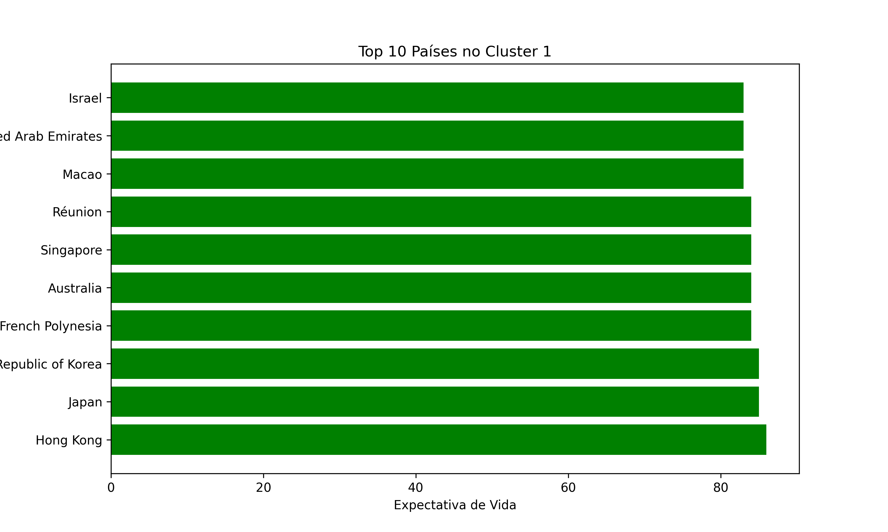
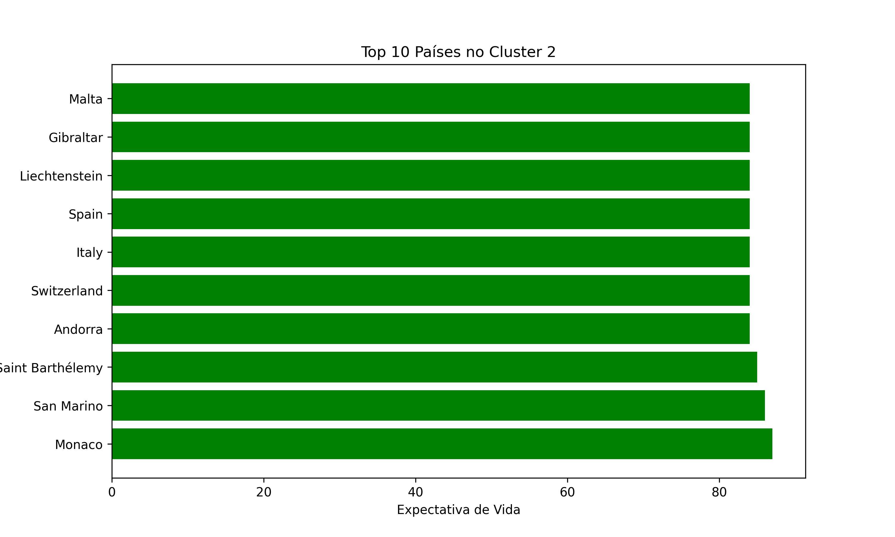
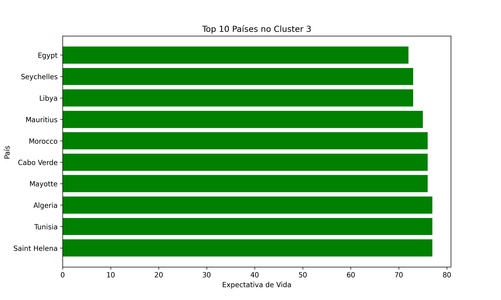
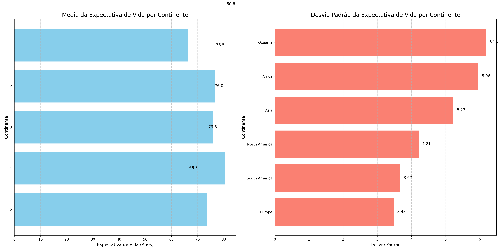

# 🌍 Análise de Expectativa de Vida por País e Continente

Este projeto realiza uma análise exploratória da **expectativa de vida** em diferentes países, agrupando-os em **clusters** com o algoritmo **K-Means** e avaliando as **médias e desvios-padrão por continente**.

---

## 📊 Metodologia

- Base de dados com informações de expectativa de vida por país.
- Pré-processamento das variáveis com `ColumnTransformer` e `StandardScaler`.
- Agrupamento utilizando **K-Means** com diferentes números de clusters.
- Análise dos **Top 10 países por cluster**.
- Cálculo de **média** e **desvio padrão** da expectativa de vida por continente.

---

## 📈 Resultados e Gráficos

### 🔹 Cluster 1 – Top 10 Países
  
➡️ Representa majoritariamente países da **Ásia** e **Oceania**, com altos níveis de expectativa de vida. Mostra forte concentração em nações desenvolvidas da região.

---

### 🔹 Cluster 2 – Top 10 Países
  
➡️ Reúne principalmente países da **Europa**, com expectativa de vida elevada e estável. Apresenta homogeneidade, indicando baixo desvio entre os países do cluster.

---

### 🔹 Cluster 3 – Top 10 Países
  
➡️ Engloba a maior parte dos países da **África**, com expectativa de vida mais baixa. É o cluster mais heterogêneo, refletindo desigualdades internas.

---

### 🔹 Medidas Centrais por Continente
  
➡️ Mostra a **média** e o **desvio padrão** da expectativa de vida por continente.  
- **Europa** apresenta a menor variabilidade.  
- **África** e **Oceania** concentram os maiores desvios.  
- **Ásia** se destaca pelo maior número de países no topo da expectativa de vida.

---

## 🛠️ Tecnologias Utilizadas

- Python 3
- Pandas
- Scikit-learn
- Matplotlib / Seaborn
- Jupyter Notebook

---
